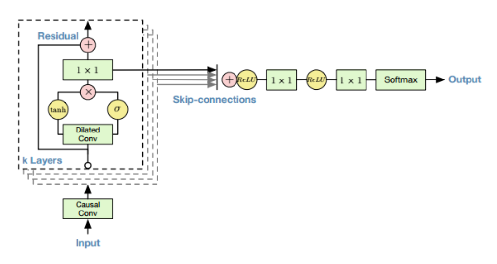
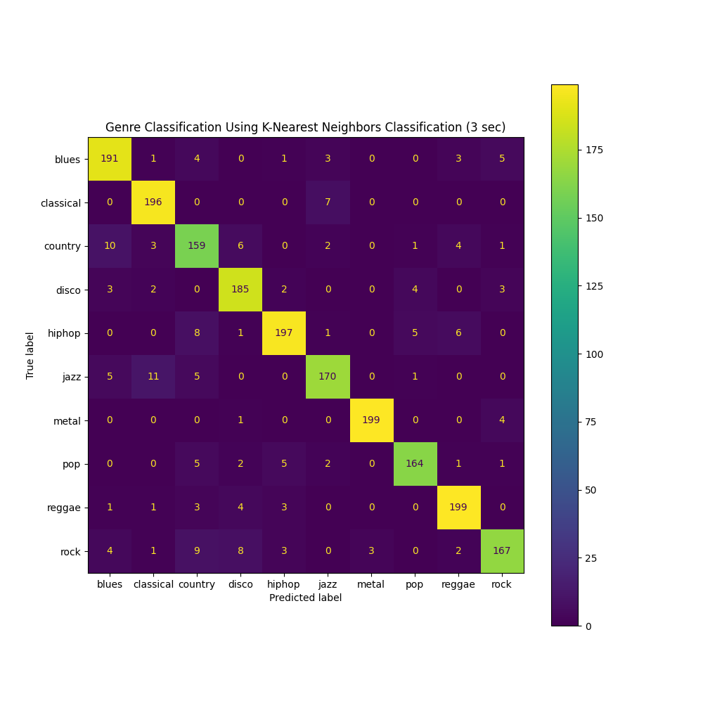
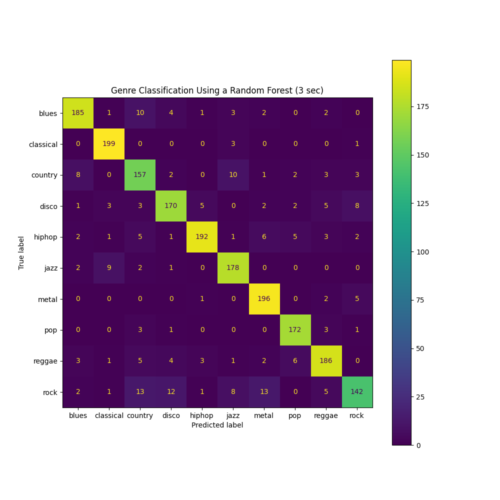
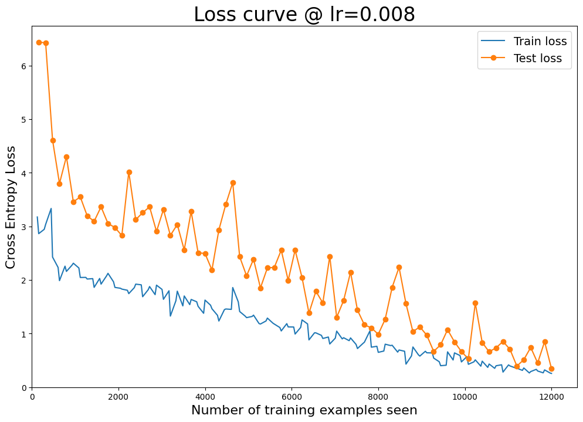

# song-classification

## Abstract:
In this project, we seek to classify the genres of songs using the GTZAN dataset. Our approach relies on a variety of methods, divided into two groups based on the different facets of the dataset. We performed a variety of statistical methods on the features derived from the audio data provided in the data set including random forest and K-Nearest neighbors classifiers. The dataset also contains audiofiles and their corresponding spectrograms, for which we used two different classes of neural networks to predict the genres of the songs. For the feature-based models, the K-NN algorithm provided the greatest accuracy with a test F1 score of 0.914 on the larger dataset. For the neural networks, the spectrogram-based models reached a final test accuracy of 0.9, while the audio-based models did not work nearly as well and reached a maximum test accuracy of 0.24

## Introduction
Audio and music data is very unique in the world of machine learning, as it can be represented in several ways. Any audio can be represented either through a raw audio file (wave, mp3, aif, etc.) or a spectrogram. Music in particular can also be represented via midi, allowing this type of data to take advantage of models designed for NLP. Additionally, other features about the audio can be derived and used to make predictions about the audio without even directly using the audio or spectrogram. 

This particular task of genre classification is not a novel task, but it does present a good forum for exploring how different models working with different representations of the same audio can perform, and it gives us insight as to the various tradeoffs between the different approaches to classifying (or performing other tasks on) audio/music data. 

The approaches we used fall under two broad categories: statistical/feature-based methods, and neural networks for working directly with the audio and spectrogram data. We expect these models to work well, as methods such as decision trees and KNN work well with feature-based data, while neural networks perform best with more complex data like audio and images. 

Some of our biggest limitations for these approaches(particularly the neural nets) are computational resources for training and evaluating the network.

## Setup
The GTZAN dataset contains 10,000 30-second audio files from 10 different genres (1,000 songs per genre), as well as spectrograms generated from these audio files. The datset also contains two csv files with data derived from the audio files, one corresponding to the 30-second audio files, and another corresponding to 3-second snippets of audio taken from the 30-second files (resulting in 100,000 datapoints). 

For the Statistical models, each of the csv files (3 and 30 second) were ran through each of a random forest and KNN classifier algorithm. First, the optimal parameters were found using train and test F1 scores. These parameters included the number of trees and max depth of those trees for the forest, and number of neighbors for the KNN algorithm. The models were then fitted and used to predict labels with these optimal parameters. 

For the neural networks, we tested a feedforward convolutional network with various numbers of convolutional layers, filter counts, and regularization over a range of learning rates and numbers of pochs. For the audio, we used a WaveNet inspired by DeepMind's 2018 paper of the same name due to its efficacy at extracting data from audio files (trying various numbers of convolutional/residual blocks, dilation depths, and learning rates). To train these models, we initially developed on our local machines to setup the models, and once they were capable of successfully training for 3 epochs, we used Google Colab to perform the full hyperparameter search to find regions where a good learning rate and other hyperparameters may lie.  

Additionally, we split the 30-second audio files into 3-second snippets corresponding to the 3 second data provided in the dataset, and also genreated the corresponding spectrograms. The use of this data did not provide much improvement in accuracy and took significantly longer to train due to the increased number of samples.

Above: the structure of one of the residual blocks in a WaveNet

Above: One of the Wavenet's dilated conv stacks 

## Results

In the Random Forest the 3 second snippet data, unsuprisingly, performed better than the 30 second one. Optimal parameters were achieved at n_estimators=441 and max_depth=36, though the max_depth performed similarly well at None. These parameters resulted in a train f1 score of 0.999249 and test f1 of 0.89239. For the KNN model, the 3 second data set was also the one that yielded better results. The ideal number of neighbors was determined to be 3 and resulted in a train f1 score of 0.955 and test score of 0.914. With less overfitting and higher scores on the test data, the K-nearest neighbors algorithm looks to be the more promising option. Confusion matrixes for both of these models are located below.

For the Neural Nets, we have gotten mixed results. The spectrogram-based CNN works quite well, attaining a test accuracy of .9, a final training (Cross-Entropy) loss of .257 and a final test loss of .344. We attempted to find an architecture that could account for some of the overfitting we saw, but none performed better than the model with slight overfitting with a test accuracy of .9, which is still quite good. 

For the audio data, we created two types of networks: a simple 1-Dimensional CNN and a WaveNet. Neither of these networks performed nearly as well as the spectrogram models, with the WaveNet never converging, and the 1d CNN obtaining a best test accuracy of .24, only slightly better than random guessing. This is most likely because the networks cannot detect major features pertaining to genre with the size of kernels we had to use due to computational constraints. The Wavenet's lack of success is likely due to the fact that its structure is originally intended to apply effects to the audio (such as reverberation or emulation of an amplifier), but the long-term structure that this model uses to preserve subtle spectral qualities does not translate as well to the high-level characteristics needed to classify genre as we had hoped it would. These models may work with larger kernels and larger dilations, but they are prohibitively computationally expensive to be of use to us with our current technical limitations. 

## Discussion

The statistical models are a promising option and have provided a high-accuracy way of classification. The only issue is that they are based on metrics that have to be calculated. this has to be done either manually or by another machine learning model, which begs the question: why not just train the model to do the classification directly? If there becomes a standardized way of calculating these features from sound bytes, then this approach is a quick and fairly accurate way of determining the genre of any sound.

The spectrogram models were very successful at this task, attaining a test accuracy of 0.9. The audio models did not work as well as hoped, though this was not exceptionally unexpected since they are very computationally expensive, and to use hyperparameters that may be successful with this type of neural network would require computational resources greater than we had access to for this project. Despite the lack of great success in the audio models, our most successful 1d convolutional model attained a test accuracy of .24, which is better than randomly guessing, though not as good as the predictions from the spectrogram model. These results are not exceptionally surprising as mel-spectrograms are widely used for classifying audio for many of the reasons we found in our experimentation. However, we do think that the audio-based models may still be useful in genre classification for songs where the possible genres are very similar (such as similar-sounding genres like funk and disco, or different subgenres of a major genre, i.e. bebop and big band swing) and their differences may not be particularly clear from the spectrogram, which loses some of the more granular data of the audio.

# References
WaveNet: A Generative Model for Raw Audio https://arxiv.org/pdf/1609.03499.pdf

Takuya Akiba, Shotaro Sano, Toshihiko Yanase, Takeru Ohta,and Masanori Koyama. 2019.
Optuna: A Next-generation Hyperparameter Optimization Framework. In KDD.
